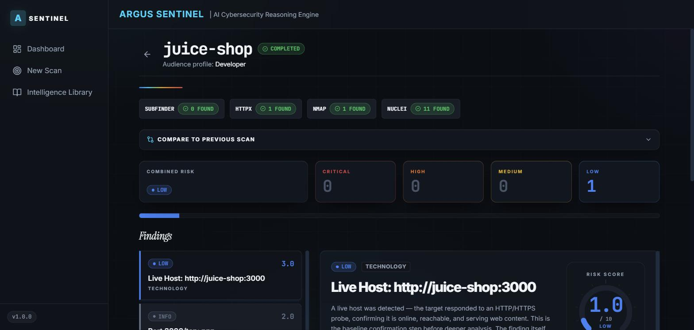
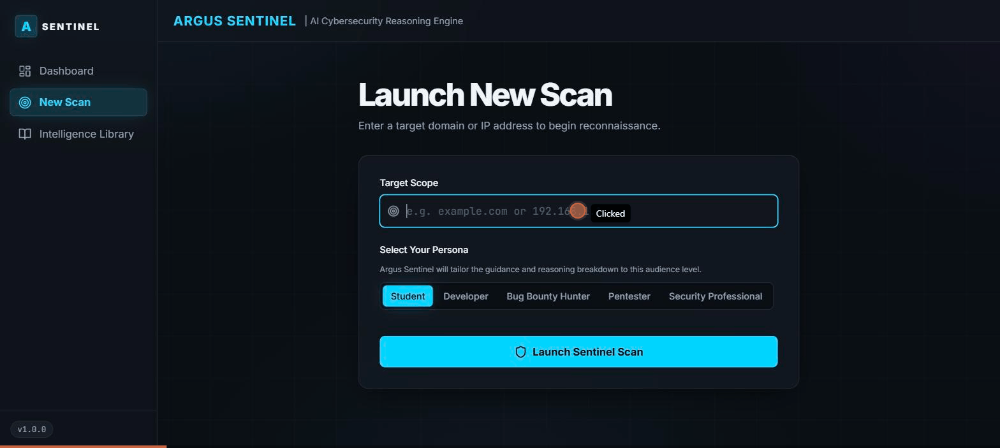
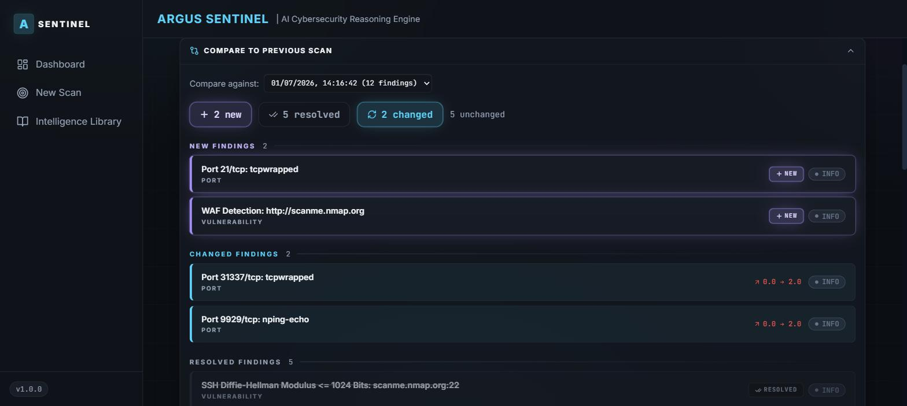
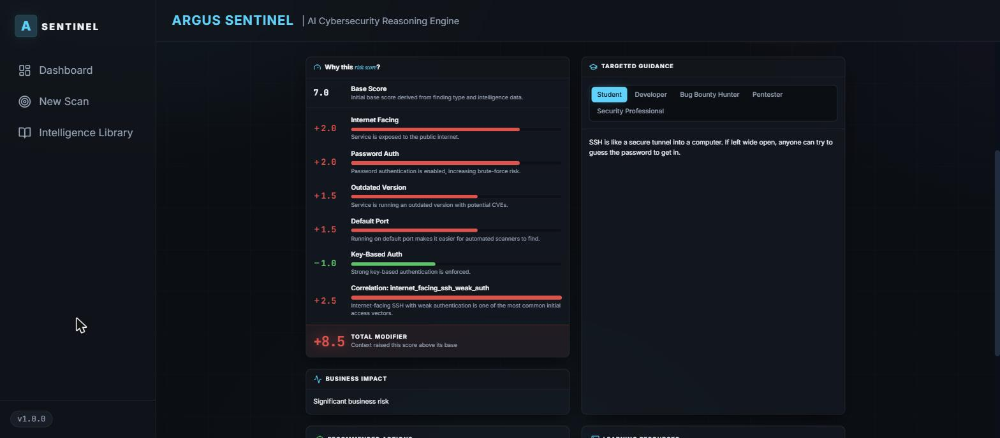
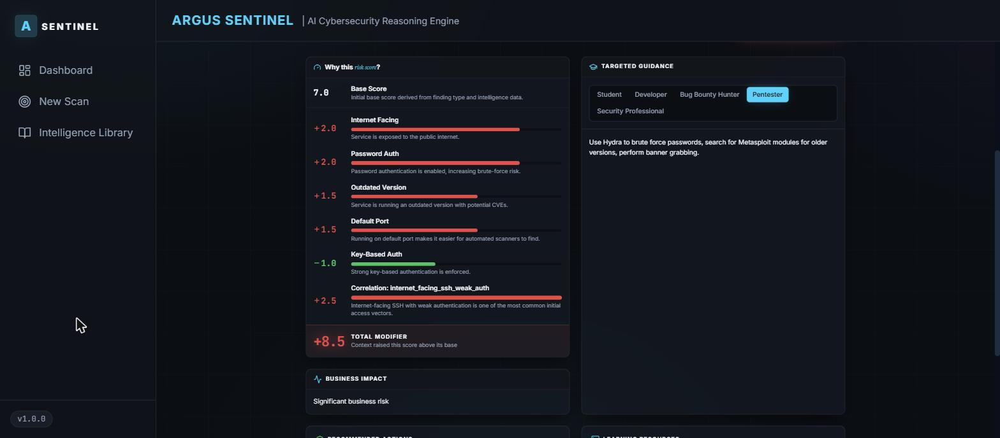

# Argus Sentinel


<!--
  No CI badge: there is no GitHub Actions workflow in this repo yet, so
  there is nothing honest to point a badge at. See notes.md for this
  session's note on adding one as a reasonable future improvement, and add
  the badge here once `.github/workflows/` actually exists.
-->

Argus Sentinel is a self-hosted web recon tool: point it at a target and it runs subfinder, httpx, nmap, and nuclei in a real sequential pipeline, then a correlation/reasoning engine turns the raw output into risk-scored findings — each with an explained "why" and guidance tailored to who's reading it. Built for authorized testing of owned/permitted targets, with a bundled OWASP Juice Shop container as the default safe local target.



*Scan Detail view of a real, completed scan against the bundled Juice Shop target — real findings, real risk scores, not staged data.*

## What It Does

- **Real sequential recon pipeline** — subfinder discovers subdomains, httpx confirms which are actually live and fingerprints their technology, and nmap/nuclei then only scan what httpx confirmed live — not four tools fired blind and independently.
- **Scan-history diffing** — rerun a target and every scan is compared against a previous one: what's **NEW**, what's **RESOLVED**, and what **CHANGED** (old and new risk score side by side). Pick any earlier scan of the same target to compare against.
- **Correlation & reasoning scoring engine** — every finding ships with a `reasoning_breakdown`: a base score plus labeled modifiers (e.g. internet-facing, password auth enabled, outdated version, default port) and any cross-finding correlation rules that fired, so you see *why* a score is what it is, not just a severity label.
- **Audience-specific guidance** — the same finding reads differently for a Student, Developer, Bug Bounty Hunter, Pentester, or Security Professional; pick who's reading and the guidance adapts.
- **51-entry intelligence library** — a real, verified JSON knowledge base (25 services, 12 technologies, 14 vulnerability classes) the scoring engines actually read from at scan time, and browsable directly in the UI.
- **Dashboard** — severity distribution, finding-type breakdown, and scan history across every target you've scanned.
- **Hardened by default** — API-key auth, SSRF target validation, rate-limited scan creation, restricted CORS, no DB/Redis ports exposed. An optional demo mode locks scanning to two authorized targets and prunes demo scans after 24h (see [DEMO_DEPLOYMENT.md](DEMO_DEPLOYMENT.md)).

## Quick Start

```bash
git clone https://github.com/Ayaan1911/Argus-Sentinel
cd Argus-Sentinel
bash scripts/setup.sh
docker compose up --build -d
```

`scripts/setup.sh` creates `.env` and `frontend/.env` from their `.example` templates with a real, matching, randomly-generated `API_KEY` already filled in on both sides — there's no manual editing step for a normal local dev setup. The only real prerequisite is Docker itself (`docker compose version` to confirm you have the Compose plugin).

| Service | URL |
|---|---|
| Frontend | http://localhost:5173 |
| API | http://localhost:8000 |
| API docs | http://localhost:8000/docs |
| OWASP Juice Shop (bundled scan target) | http://localhost:3000 |

Every API call other than `/health` requires the `X-API-Key` header, matching the `API_KEY` in `.env`. Run a scan against the bundled Juice Shop instance to see real output end to end:

```bash
curl -X POST http://localhost:8000/api/v1/scans/ \
  -H "X-API-Key: $(grep '^API_KEY=' .env | cut -d= -f2-)" \
  -H "Content-Type: application/json" \
  -d '{"target": "juice-shop"}'
```

`db` and `redis` are not exposed to the host — only `api` (8000), `frontend` (5173), and the `juice-shop` target container (3000) publish ports.

The two commands above (`scripts/setup.sh`, then `docker compose up`) are how you see Argus Sentinel running — it's self-hosted by design, so there's no hosted instance to visit. Everything below is captured from a real local stack.

## See It Run

A real scan, recorded end to end: target submitted, the pipeline runs, and the finished Scan Detail page comes back with per-tool results and scored findings. (Per-tool `stage_status` is written when the pipeline finishes, so the stage pills appear on completion rather than ticking over one by one.)



### Scan-history diffing

Two real scans of `scanme.nmap.org`, compared: two ports/checks that newly appeared, five that were resolved, and two whose risk score changed between runs (`0.0 → 2.0`).



### Why this risk score + audience-specific guidance

A real finding from a real scan of `scanme.nmap.org`: SSH on port 22, OpenSSH 6.6.1 with password auth enabled. Base score 7.0, then five reasoning modifiers from what nmap actually reported, plus the `internet_facing_ssh_weak_auth` correlation rule (+2.5). The total is +8.5, so the final score is capped at 10.0 CRITICAL. It's shown as a **Student** (left) and as a **Pentester** (right): the score and evidence stay fixed, and the guidance changes for who's reading.

<p>
  
  
</p>

## Why Self-Hosted, Not a Hosted Service

There's no shared "run your scan on our infrastructure" option, and that's deliberate, not a limitation waiting to be lifted. Once you self-host, nothing about what you scan — targets, findings, timing, anything — ever touches infrastructure this project controls, by construction. There's no telemetry phoning home and no shared backend to design access controls for in the first place. If you want to try the tool before self-hosting it, the bundled Juice Shop container gives you a real, safe, fully-featured scan target from the first `docker compose up` — see Quick Start above.

## The Pipeline

Scanning is a real sequential pipeline, not four independent tool calls fired in parallel:

```
subfinder(target)
  → httpx(target + all discovered subdomains)
    → nmap(target + only the discovered subdomains httpx confirmed live)
    → nuclei(target + only the discovered subdomains httpx confirmed live)
```

subfinder's output feeds httpx so every discovered subdomain gets a liveness check; nmap and nuclei then only spend time on the target plus whatever subfinder found that httpx actually confirmed responds — not the full unfiltered subdomain list. Candidates with no DNS record at all (neither A nor CNAME) are discarded before they ever become a finding, since third-party passive sources occasionally fabricate results for domains they have no real data on. Each stage's outcome is tracked independently in `stage_status` (`success` / `failed` / `timeout` / `no_binary` per tool), not collapsed into one overall scan status.

## Scoring: Correlation, Reasoning, and Confidence

Raw scanner output alone isn't a finding — it's an input. Three engines turn it into something explainable:

- **Reasoning Engine** — assigns a deterministic base risk score per finding type (port/service, vulnerability, technology, subdomain), then applies labeled modifiers (internet-facing, no authentication, outdated version, admin panel exposed, WAF detected, etc.) sourced from the scanner's raw output and the matching intelligence library entry. Every score ships with a `reasoning_breakdown` array showing exactly which modifiers fired and why.
- **Correlation Engine** — looks across all of a scan's findings together, not just one at a time, and adds a modifier on top of a finding's own reasoning score when a specific combination shows up. There are six rules, each driven only by signals the four scanners actually produce:

  | Rule | Fires when | Modifier | Seen on a real scan? |
  |---|---|---|---|
  | `internet_facing_ssh_weak_auth` | nmap sees SSH on a public IP and `ssh-auth-methods` lists `password` | +2.5 | ✅ scanme.nmap.org |
  | `outdated_stack_with_vuln` | nmap/httpx detect a version below the library's `min_secure_version`, and nuclei reports a vulnerability in the same scan | +2.0 per vuln | ✅ scanme.nmap.org (OpenSSH 6.6.1) |
  | `open_database_no_auth` | nmap's `redis-info` gets server info back from Redis without credentials | +3.0 | Checked against a real auth-less Redis; no public target scanned |
  | `admin_panel_exposed` | httpx finds a live URL whose path or page title looks like an admin/login panel | +1.5 | Pipeline-tested only |
  | `subdomain_takeover_critical` | subfinder finds a subdomain CNAME'd to a known third-party host that no longer resolves | +3.0 | Pipeline-tested only |
  | `multiple_high_severity` | ≥3 findings scoring ≥6.1 (raises the scan's combined risk, not any single finding) | +1.5 | Pipeline-tested only |

  "Pipeline-tested" means a Postgres-backed test feeds real-shaped tool output through the actual scanner parsers, scoring, and storage, and checks the modifier comes out the other end (`test_every_correlation_rule_fires_through_the_real_pipeline`). The bundled Juice Shop target triggers none of them, which is correct: it has no SSH or database ports, nmap can't version its Node service, and its title isn't an admin page.
- **Confidence Engine** — separately scores how *certain* a finding is (scanner reliability + corroborating evidence + intelligence-library match), independent of how severe it is — a finding can be high-confidence and low-severity, or the reverse.

All three are backed by **`argus-intelligence/`**, a 51-entry JSON knowledge base (25 services, 12 technologies, 14 vulnerability classes) that the scoring engines look up by scanner-reported name/product — not a hardcoded lookup table inline in the scoring code.

## Security Posture

- **Authentication** — every endpoint except `/health` requires a valid `X-API-Key` header; requests without one get a `401`.
- **SSRF target validation** — submitted targets are resolved and rejected with a `422` before any scan is dispatched if they resolve to a loopback, link-local (including the `169.254.169.254` cloud metadata address), private, reserved, or multicast address. The bundled `juice-shop` container is explicitly allowlisted as the intended local target.
- **Rate limiting** — scan creation (`POST /api/v1/scans/`) is limited to 5 requests/minute per client.
- **CORS** — restricted to the origins listed in `ALLOWED_ORIGINS` (`.env`), not wide open.

## Frontend

React 18 + Vite + Tailwind, talking to the API over axios with the API key wired in automatically:

| Page | Route | Purpose |
|---|---|---|
| Landing | `/` | Standalone public marketing page — no scan data, no auth required |
| Dashboard | `/dashboard` | Scan history, severity distribution, finding-type breakdown |
| New Scan | `/scan/new` | Submit a target + choose an audience persona |
| Scan Detail | `/scan/:scan_id` | Live per-tool `stage_status`, findings list, combined risk level — polls the scan while running and stops once it reaches a terminal status; for a target with prior completed scans, also offers a diff view showing what's new/resolved/changed/unchanged since a previous run |
| Finding Detail | `/scan/:scan_id/finding/:finding_id` | Full reasoning breakdown, attack patterns, recommended actions, audience-specific guidance for one finding |
| Intelligence Library | `/intelligence` | Browse the 51-entry services/technologies/vulnerabilities knowledge base directly |

## Tech Stack

| Layer | Technology |
|---|---|
| API | FastAPI + Python 3.11 |
| Task queue | Celery + Redis |
| Database | PostgreSQL 15 (SQLAlchemy ORM, no raw SQL) |
| Frontend | React 18 + Vite + Tailwind CSS |
| Scanners | subfinder, ProjectDiscovery httpx, nmap, nuclei |
| Containers | Docker Compose |

## Real Scan Output

From an actual scan run against the bundled Juice Shop target (`target: "juice-shop"`) — not a fixture:

```json
{
  "status": "completed",
  "stage_status": {
    "subfinder": { "status": "success" },
    "httpx":     { "status": "success" },
    "nmap":      { "status": "success" },
    "nuclei":    { "status": "success" }
  },
  "finding_count": 4
}
```

| Type | Severity | Risk Score | Title |
|---|---|---|---|
| technology | low | 3.0 | Live Host: http://juice-shop:3000 |
| port | informational | 2.0 | Port 3000/tcp: ppp |
| vulnerability | informational | 1.0 | Public Swagger API - Detect: http://juice-shop:3000/api-docs/swagger.yaml |
| vulnerability | informational | 1.0 | Prometheus Metrics - Detect: http://juice-shop:3000/metrics |

subfinder correctly reports 0 real subdomains for `juice-shop` (it isn't a real internet domain — any passive-source hits get resolved and discarded if they don't actually exist in DNS). Risk scores vary by finding type and the specific data each scanner returned — not a flat default.

## Testing

```bash
cd backend && pytest        # 123 tests
cd frontend && npm test     # vitest, 21 tests
```

The backend suite includes pure-Python unit tests for the scoring engines, scanner argv/output-parsing logic, and the intelligence-library schema validator, plus a real Postgres-backed integration suite (`test_routes.py`, `test_scan_tasks.py`) that spins up a throwaway Postgres container via Docker and exercises actual API routes and task orchestration end-to-end — those tests skip automatically if Docker isn't reachable (e.g. running the suite from inside a container itself with no Docker-in-Docker access) rather than silently passing on mocked data. The frontend suite covers `ScanDetail`'s polling logic (`nextPollDelay`), the scan-diff comparison view, the reasoning-breakdown score math, and the New Scan form (demo-mode target lock, persona selection).

## Known Limitations

- **Intelligence library coverage**: 51 entries across services/technologies/vulnerabilities. A finding whose scanner-reported name/product doesn't match an entry still gets a base reasoning score, just without library-sourced guidance.
- **nmap's outdated-version detection** only covers products it has a matching intelligence-library entry for (openssh, apache, nginx, mysql, postgresql, redis, mongodb) — an unlisted stack won't trigger "outdated version" modifiers even if nmap fingerprints it correctly.
- **httpx/nuclei port coverage**: beyond 80/443, only a fixed list of common alternate web ports (3000, 8000, 8080, 8888) is probed — a target on an uncommon port outside that list won't be found.
- **External target scanning** requires the `worker` container to have outbound internet access; passive sources like subfinder's will reach out to third-party APIs over the network for any target, including ones you don't expect to need it.

---

The original product vision and design philosophy this project started from is in [ARGUS_SENTINEL.md](ARGUS_SENTINEL.md) — note that document predates the current implementation and describes a broader long-term scope than what exists today; this README is the accurate description of the current codebase.

## Contributing

See [CONTRIBUTING.md](CONTRIBUTING.md) for dev environment setup, running tests, code conventions, and PR expectations. **If you want to help without touching Python or React, adding a new entry to the intelligence library is the best first contribution** — see [argus-intelligence/CONTRIBUTING.md](argus-intelligence/CONTRIBUTING.md).

## License

MIT — see [LICENSE](LICENSE).
