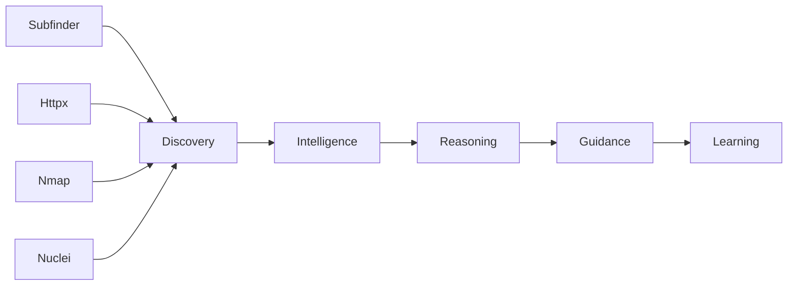

# Argus Sentinel

**A security reconnaissance tool that explains what it found, not just what it scanned.**


---

<!-- Add a GIF or screenshot of the Intelligence Card UI here — the findings table + Analyze panel with Reasoning Breakdown visible -->
> **Screenshot coming soon** — scan result showing severity breakdown, reasoning scores, and audience guidance switching between personas.

---

## Quick Start

```bash
git clone https://github.com/Ayaan1911/Argus-Sentinel
cd Argus-Sentinel
cp .env.example .env
docker compose up --build
```

| Service | URL |
|---|---|
| Frontend | http://localhost:5173 |
| API | http://localhost:8000 |
| API docs | http://localhost:8000/docs |
| OWASP Juice Shop (scan target) | http://localhost:3000 |

Run a scan against the bundled Juice Shop instance to verify the full pipeline:

```bash
curl -X POST http://localhost:8000/api/v1/scans/ \
  -H "Content-Type: application/json" \
  -d '{"target": "http://juice-shop:3000"}'
```

---

## The Core Idea

Most security tools answer *"what did you find?"* Argus answers *"what does it mean, why does it matter, and what should you do next?"* The scanners (Subfinder, Httpx, Nmap, Nuclei) are inputs — the Intelligence Library and deterministic Reasoning Engine are the product. Every finding shows its score breakdown; every score is explainable by design, not a black-box output.

→ [Full architecture, Intelligence Library schema, and design philosophy in ARGUS_SENTINEL.md](ARGUS_SENTINEL.md)

---

## Architecture



Each stage adds a layer that scanners alone cannot provide: raw findings → contextual knowledge → risk scores with breakdowns → ordered action steps → audience-specific explanations (Student / Developer / Bug Bounty Hunter / Security Professional).

---

## Tech Stack

| Layer | Technology |
|---|---|
| API | FastAPI + Python 3.11 |
| Task queue | Celery + Redis |
| Database | PostgreSQL 15 |
| Frontend | React 18 + Vite + Tailwind CSS |
| Scanners | Subfinder, Httpx, Nmap, Nuclei v3 |
| Containers | Docker Compose |

---

## Verified Behavior

Tested against OWASP Juice Shop on the same Docker network:

- Nuclei v3.3.9 at `/usr/local/bin/nuclei` — matches hardcoded path in scanner config
- Templates loaded: 2898 across `exposure`, `misconfig`, `tech` tags
- Scan result: 13 findings including Public Swagger API exposure, missing security headers, FingerprintHub/Wappalyzer tech fingerprints, and Prometheus metrics endpoint
- Every finding carries a `reasoning_breakdown` array with labeled score modifiers
- Audience guidance populates for all findings matched against the Intelligence Library
- Persona switching (Student → Developer → Bug Bounty Hunter → Security Professional) changes guidance content, not just the label

---

## Known Limitations

- **WAF-hardened targets** (e.g. github.com) return fewer findings by design. Nuclei backs off on 429s — this is rate-limit compliance, not a broken network path.
- **External target scanning** requires the worker container to have outbound internet access. Internal targets must be on the same Docker network.
- **Intelligence Library coverage** is V1 scope: 5 services (SSH, HTTP, HTTPS, MySQL, Redis), 4 technologies (Apache, Nginx, Tomcat, WordPress), 5 vulnerability classes (SQLi, XSS, SSRF, IDOR, RCE). Findings outside this set receive base reasoning only — `audience_guidance` will be empty for unmatched template IDs.
- **No API authentication** in V1. Do not expose port 8000 publicly.

---

For full vision, V2 roadmap, and design decisions: [ARGUS_SENTINEL.md](ARGUS_SENTINEL.md)

---

## License

MIT — see [LICENSE](LICENSE) for details.
