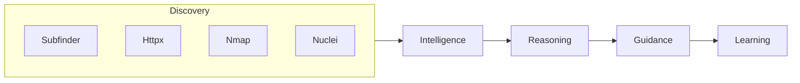

# Argus Sentinel


AI-Powered Cybersecurity Reasoning Engine — turns raw scan output into prioritized, explainable findings with audience-aware guidance.

## Why I Built This

Most security tools answer: **"What did you find?"** But for many teams, a list of 500 unprioritized CVEs and ports is overwhelming and unactionable. I built Argus to answer the questions that actually matter: **"What does it mean, why does it matter, and what should you do next?"** By wrapping industry-standard scanners in an intelligence and deterministic reasoning layer, Argus turns raw data into contextualized, audience-aware knowledge that developers and security teams can actually use.

## Table of Contents
- [Quick Start](#quick-start)
- [Architecture](#architecture)
- [Tech Stack](#tech-stack)
- [Screenshots](#screenshots)
- [Verified Behavior](#verified-behavior)
- [Known Limitations](#known-limitations)
- [Roadmap (V2)](#roadmap-v2)
- [License](#license)

---

## Quick Start

```bash
git clone https://github.com/Ayaan1911/Argus-Sentinel
cd Argus-Sentinel

cp .env.example .env
# Edit .env if you need non-default credentials

docker compose up --build
```

Services after startup:
- Frontend: http://localhost:5173
- API: http://localhost:8000
- API docs: http://localhost:8000/docs
- OWASP Juice Shop (local scan target): http://localhost:3000

Run a scan against Juice Shop to verify the full pipeline end-to-end:
```bash
curl -X POST http://localhost:8000/api/v1/scans/ \
  -H "Content-Type: application/json" \
  -d '{"target": "http://juice-shop:3000"}'
```

---

## Architecture



**Discovery** — Subfinder enumerates subdomains, Httpx probes live hosts, Nmap maps ports and services, Nuclei runs vulnerability templates.

**Intelligence** — Raw findings are matched against the Argus Intelligence Library: a structured knowledge base of services, technologies, and vulnerability classes. A port 22 finding becomes a contextualized SSH exposure with known attack patterns and real-world incident context.

**Reasoning** — A deterministic engine calculates risk scores from explicit modifiers (exposure, misconfiguration, known CVEs, correlation). Every score shows its work — no black-box outputs.

**Guidance** — Every finding produces a prioritized action list specific to what was actually found, not generic advice.

**Learning** — The same finding is explained differently based on the selected audience: Student, Developer, Bug Bounty Hunter, or Security Professional.

---

## Tech Stack

| Layer | Technology |
|---|---|
| API | FastAPI + Python 3.11 |
| Task queue | Celery + Redis |
| Database | PostgreSQL 15 (SQLAlchemy async) |
| Frontend | React 18 + Vite + Tailwind CSS |
| Scanners | Subfinder, Httpx, Nmap, Nuclei v3 |
| Containers | Docker Compose |

---

## Screenshots

[Add 2-3 screenshots/GIF of the scan flow and Intelligence Card here before publishing]

---

## Verified Behavior

Tested against OWASP Juice Shop running in the same Docker network:

- Nuclei v3.3.9 binary at `/usr/local/bin/nuclei` — matches hardcoded path in scanner config
- Templates loaded: 2898 across `exposure`, `misconfig`, `tech` tags
- Scan result (Juice Shop): 13 findings including Public Swagger API exposure, missing security headers, tech fingerprints (FingerprintHub, Wappalyzer), and Prometheus metrics endpoint
- Each finding carries a `reasoning_breakdown` array with labeled score modifiers
- Audience guidance populates for findings matched against the Intelligence Library

---

## Known Limitations

- **WAF-hardened targets** like github.com intentionally return fewer findings. Nuclei is rate-limited to 50 req/s and backs off on 429s — this is by design, not a bug.
- **Network reachability** depends on host environment. Scanning external targets requires the worker container to have outbound internet access. Internal targets (like Juice Shop) must be on the same Docker network.
- **Intelligence Library coverage** is V1 scope: 5 services (SSH, HTTP, HTTPS, MySQL, Redis), 4 technologies (Apache, Nginx, Tomcat, WordPress), 5 vulnerability classes (SQLi, XSS, SSRF, IDOR, RCE). Findings outside this coverage get base reasoning only — `audience_guidance` will be empty for unmatched template IDs.
- **No authentication** on the API in V1. Do not expose port 8000 publicly.

---

## Roadmap (V2)

- **Headless Discovery & Crawling**: Enhance the discovery phase by introducing web crawling capabilities to map application surfaces more deeply.
- **Deep Scan Mode**: Run comprehensive, deeply intrusive scan configurations on verified assets.
- **Katana Integration**: Leverage ProjectDiscovery's Katana for advanced payload generation and fuzzing.

---

## License

MIT — see [LICENSE](LICENSE) for details. (Note: Please confirm this license preference)
